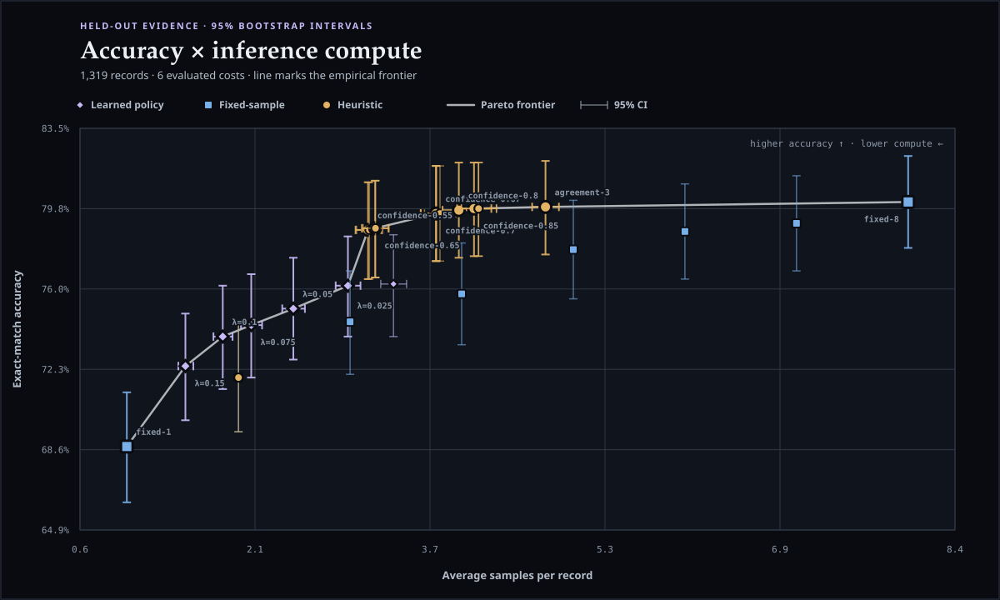
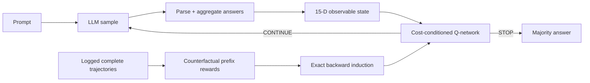

<div align="center">

# BranchPilot

**A lightweight cost-conditioned controller that stops LLM self-consistency at the prompt-specific point of diminishing returns.**

[](https://github.com/mottopanikeiku/branchpilot/actions/workflows/ci.yml)
[](https://mottopanikeiku.github.io/branchpilot/)
[](https://www.python.org/)
[](https://modal.com/)
[](LICENSE)



</div>

Most inference-time scaling systems pick one global sample count: easy prompts are overthought; hard prompts are abandoned too early. BranchPilot turns that systems decision into an observable finite-horizon stopping problem. A single universal Q-network watches agreement, parse coverage, answer entropy, sequence confidence, completion length, prompt structure, remaining horizon, and a user-selected cost $\lambda$. It chooses **STOP** or **CONTINUE** after every observed sample.

Complete offline trajectories expose the STOP reward and next prefix at every step. BranchPilot solves each logged trajectory exactly by backward induction, then distills those counterfactual Q-values into one cost-conditioned policy. Deployment uses a Torch-free NumPy runtime and bounded, non-executable Safetensors artifacts.

## Canonical v0.2 result: the protocol failed

The locked evaluation uses **Qwen2.5-1.5B-Instruct**, 1,600 controller-training prompts, 400 validation prompts, and the complete **1,319-example official GSM8K test**, with 8 samples per prompt. Comparator names were selected on validation and committed before test. Every point uses 10,000 paired prompt-bootstrap resamples.

**The prespecified success rule did not pass.** Utility-delta 95% lower bounds at the three primary costs were $-0.0152$, $-0.0422$, and $-0.0491$; the protocol required at least two to be strictly positive and the third nonnegative. BranchPilot advances the static fixed-count frontier between roughly 1.5 and 3 samples, but simple adaptive agreement/confidence rules remain stronger under the frozen utility comparison.

| Policy | Accuracy | Avg. samples | What the official test shows |
|---|---:|---:|---|
| fixed-1 | 68.8% | 1.00 | minimum-compute reference |
| BranchPilot $\lambda=0.15$ | 72.5% | 1.52 | learned static-frontier point |
| fixed-2 | 71.9% | 2.00 | static reference |
| BranchPilot $\lambda=0.05$ | 75.1% | 2.49 | fewer samples and higher accuracy than fixed-3 |
| fixed-3 | 74.5% | 3.00 | static reference |
| BranchPilot $\lambda=0.025$ | 76.2% | 2.98 | +1.7 points versus fixed-3 at similar compute |
| agreement-2 | 78.8% | 3.23 | frozen low-cost adaptive comparator |
| fixed-8 | 80.1% | 8.00 | maximum-sample ceiling |

This is the result, not a buried caveat. The [interactive evidence report](benchmarks/report-v2.html) renders the FAIL verdict, exact rule, primary/sensitivity costs, paired intervals, stop histograms, provenance chain, and every declared limitation. Machine evidence: [test JSON](benchmarks/gsm8k-v2.json), [validation freeze](benchmarks/gsm8k-v2-validation.json), [generation manifest](benchmarks/manifest-v2.json), [protocol](benchmarks/protocol.json), and [detached checksums](benchmarks/checksums-v2.txt). The pinned L4 run generated 6,352,308 completion tokens in 2,565.6 measured generation-seconds at 2,476 tokens/s.

## Legacy exploratory v0.1 result

The original v0.1 benchmark was an exploratory point-estimate study: **Qwen2.5-1.5B-Instruct**, 8 stochastic samples per prompt, 512 controller-training trajectories, and 256 controller-held-out trajectories drawn from GSM8K train. It used one generation seed, one controller seed, a sparse baseline grid, no confidence intervals, and a permissive parser that could accept a final number from token-limit-truncated reasoning. It is retained for provenance, not promoted as v0.2 evidence.

| Policy | Accuracy | Avg. samples | Comparison |
|---|---:|---:|---|
| fixed-2 | 58.2% | 2.00 | static baseline |
| **BranchPilot $\lambda=0.10$** | **63.3%** | **1.92** | **+5.1 points with less compute** |
| fixed-4 | 66.8% | 4.00 | static baseline |
| **BranchPilot $\lambda=0.025$** | **68.8%** | **3.71** | **+2.0 points with 7.1% fewer samples** |
| fixed-8 | 73.4% | 8.00 | maximum-compute ceiling |

The observed v0.1 utility $U=\text{accuracy}-\lambda\times\text{samples}$ favored the learned controller over the listed fixed-count and agreement/confidence baselines at $\lambda\in\{0.05,0.075,0.10\}$. This is not yet a confirmatory or generality claim. Full aggregate rows live in [`benchmarks/gsm8k.json`](benchmarks/gsm8k.json), with recorded provenance in [`benchmarks/manifest.json`](benchmarks/manifest.json) and the standalone report in [`benchmarks/report.html`](benchmarks/report.html).

## How it works



For prefix state $s_t$ and action $a_t$:

$$
r(s_t, \mathrm{STOP})=\mathbb{1}[\hat y_t=y], \qquad
r(s_t, \mathrm{CONTINUE})=-\lambda
$$

$$
Q(s_t,\mathrm{CONTINUE};\lambda)=-\lambda+\max_a Q(s_{t+1},a;\lambda)
$$

The 15 observable features include vote share and margin, normalized answer entropy, diversity, parse and log-probability coverage, finite sequence-confidence statistics, latest-sample agreement, completion-length statistics, prompt token/character length, numeric density, and horizon progress. Three conditioning features add $\lambda$, normalized remaining horizon, and their interaction. One network covers the declared training-cost interval; inference applies isotonic advantage projection so higher cost cannot make a shared prefix more likely to continue.

Training regresses exact finite-horizon Q-targets with Huber loss, deterministic seeds, gradient clipping, and explicit terminal-action masking. PyTorch is isolated to the optional training environment. Deployment and evaluation need only NumPy plus Safetensors; policy artifacts are non-pickle, strictly schema/shape/dtype/finiteness checked, size-bounded, and written atomically.

## Five-minute local demo

No model download or GPU required. The quickstart builds correlated reasoning trajectories, trains the controller with the `train` extra, evaluates fixed/heuristic baselines, renders the Pareto report, and prints a Q-value trace.

```bash
git clone https://github.com/mottopanikeiku/branchpilot
cd branchpilot
uv sync --extra dev
uv run branchpilot quickstart
python -m webbrowser "file://$PWD/artifacts/quickstart/report.html"
```

Inspect a specific decision path:

```bash
uv run branchpilot demo \
  --data artifacts/quickstart/test.jsonl \
  --policy artifacts/quickstart/policy.safetensors \
  --cost 0.05 --index 7
```

## Live inference API

Offline labels train the policy; deployment never receives a gold answer or future sample. Feed one canonicalized observation at a time and stop launching model requests as soon as the policy stops:

```python
from branchpilot import BranchPilotPolicy, Sample

policy = BranchPilotPolicy.load("policy.safetensors")
session = policy.start("What is 17 + 25?", cost=0.05, max_samples=8)

while session.should_continue:
    output = generate_one_sample()  # your vLLM, SGLang, or API call
    session.observe(
        Sample(
            text=output.text,
            answer=parse_answer(output.text),
            token_count=output.token_count,
            mean_logprob=output.mean_logprob,
        )
    )

result = session.result()
print(result.answer, result.sample_count, result.completion_tokens)
```

`PilotSession.run` and `run_async` provide callback loops with the same invariant: the sampler is called exactly once per observed decision and never after STOP.

OpenAI-compatible backends use the same loop without coupling the core package to a provider SDK:

```python
from openai import AsyncOpenAI
from branchpilot.answers import extract_answer
from branchpilot.integrations import run_openai

result = await run_openai(
    policy,
    AsyncOpenAI(base_url="http://localhost:8000/v1", api_key="local"),
    model="Qwen/Qwen2.5-1.5B-Instruct",
    messages=[{"role": "user", "content": question}],
    extractor=extract_answer,
    question=question,
    cost=0.05,
    max_samples=8,
    request_options={"temperature": 0.7, "logprobs": True},
)
```

Install the optional client with `uv sync --extra openai`. The adapter requires real completion-token usage, preserves missing log-probabilities as missing, rejects truncated answers, performs no retries or cost guessing, and issues exactly one `n=1` non-streaming request per CONTINUE step.

## Run the frozen Modal benchmark

[`benchmarks/protocol.json`](benchmarks/protocol.json) fixes the source/model revisions and hashes, immutable vLLM image digest, split sizes, sample bank, controller, baseline grid, bootstrap, success rule, and limitations before canonical generation. Collection downloads the original GSM8K JSONL at a pinned commit and verifies predeclared hashes, resolves the pinned model into a fresh ephemeral cache, inventories every model/tokenizer file and installed package, captures clean source hashes before dispatch, and publishes the three banks plus manifest as one atomic hash-bound directory.

```bash
uv sync --extra dev --extra modal
modal setup

# Generate disjoint controller-train/validation banks and the complete official test.
uv run modal run modal_app.py \
  --train-size 1600 --validation-size 400 --test-size 1319 \
  --max-samples 8 --max-tokens 512 --seed 17 \
  --protocol benchmarks/protocol.json \
  --output-dir artifacts/gsm8k-v2

# Preserve the generation manifest as canonical small evidence.
cp artifacts/gsm8k-v2/manifest.json benchmarks/manifest-v2.json

# Fail closed on duplicate or overlapping model-visible prompts.
uv run branchpilot audit \
  --data artifacts/gsm8k-v2/train.jsonl \
  --compare artifacts/gsm8k-v2/validation.jsonl
uv run branchpilot audit \
  --data artifacts/gsm8k-v2/train.jsonl \
  --compare artifacts/gsm8k-v2/test.jsonl

uv run branchpilot train \
  --data artifacts/gsm8k-v2/train.jsonl \
  --output artifacts/gsm8k-v2/policy.safetensors \
  --hidden-size 128 --epochs 120 --seed 23 \
  --protocol benchmarks/protocol.json \
  --manifest benchmarks/manifest-v2.json

# Select comparators on validation; bind names to data, policy, protocol, and benchmark hashes.
uv run branchpilot evaluate \
  --data artifacts/gsm8k-v2/validation.jsonl \
  --policy artifacts/gsm8k-v2/policy.safetensors \
  --output benchmarks/gsm8k-v2-validation.json \
  --export-baselines benchmarks/gsm8k-v2-baselines.json \
  --protocol benchmarks/protocol.json \
  --manifest benchmarks/manifest-v2.json \
  --split validation

# Commit protocol + manifest + validation benchmark + selection before test evaluation.

# Turn an average serving budget into a validation-measured λ.
uv run branchpilot plan \
  --benchmark benchmarks/gsm8k-v2-validation.json \
  --sample-budget 3.0 \
  --json-output artifacts/gsm8k-v2/operating-point.json

# Evaluate the committed policy/comparator binding once on official test.
uv run branchpilot evaluate \
  --data artifacts/gsm8k-v2/test.jsonl \
  --policy artifacts/gsm8k-v2/policy.safetensors \
  --frozen-baselines benchmarks/gsm8k-v2-baselines.json \
  --protocol benchmarks/protocol.json \
  --manifest benchmarks/manifest-v2.json \
  --split test \
  --output benchmarks/gsm8k-v2.json \
  --svg assets/gsm8k-v2-pareto.svg \
  --html benchmarks/report-v2.html
```

The report publishes all fixed counts 1–8, complete confidence/agreement grids, retained prompt-paired outcomes, bootstrap intervals, the validation-selection chain, primary-versus-sensitivity costs, exact pass/fail rule, source/data/policy/protocol hashes, and every declared limitation. Results are published unchanged whether the prespecified rule passes or fails.

## CLI

| Command | Purpose |
|---|---|
| `branchpilot quickstart` | Run the complete zero-GPU simulator → train → benchmark → report pipeline |
| `branchpilot synthetic` | Generate deterministic correlated reasoning trajectories |
| `branchpilot split` | Create seeded, fingerprinted, verified-disjoint data splits |
| `branchpilot audit` | Validate identity disjointness and profile parse/logprob/token coverage |
| `branchpilot train` | Fit exact backward Q-targets and save a safe policy artifact |
| `branchpilot evaluate` | Bootstrap exhaustive baselines; freeze or consume validation comparators |
| `branchpilot report` | Deterministically render standalone HTML/SVG evidence from canonical JSON |
| `branchpilot plan` | Select a conservative validation-measured λ for an average sample budget |
| `branchpilot demo` | Print every Q-value and STOP/CONTINUE action for one trajectory |

Run `uv run branchpilot <command> --help` for all controls.

## Data contract

BranchPilot is model-server agnostic. A JSONL trajectory needs a prompt, canonical gold answer, and one or more samples:

```json
{"schema_version":2,"uid":"gsm8k-train-0","question":"...","gold":"72","samples":[{"text":"... #### 72","answer":"72","token_count":94,"mean_logprob":-0.31,"finish_reason":"stop","parse_status":"parsed"}],"prompt_tokens":81,"metadata":{"model":"Qwen/Qwen2.5-1.5B-Instruct"}}
```

`extract_answer` is strict by default: it accepts complete `####`, XML, or LaTeX-boxed final answers and canonicalizes comma, decimal, signed, percentage, and fractional numeric forms. The frozen Modal collector separately records `parsed_explicit` and `parsed_fallback`: a last-number fallback is allowed only after the engine reports a completed response, never after token-limit truncation. Unparsed samples remain distinct and cannot manufacture false consensus.

## Repository map

```text
src/branchpilot/
  answers.py      strict answer extraction and numeric canonicalization
  features.py     offline/live prefix aggregation and 15-D state
  policy.py       Torch-free NumPy inference and safe Safetensors artifacts
  runtime.py      label-free sync/async incremental inference sessions
  training.py     exact backward Q-targets and optional PyTorch fitting
  evaluate.py     exhaustive baselines, paired bootstrap, retained outcomes
  calibration.py  validation-based average-budget operating-point selection
  integrity.py    canonical fingerprints, overlap checks, dataset profiles
  provenance.py   frozen protocol and byte-exact manifest verification
  report.py       interactive dependency-free HTML + accessible SVG evidence
  artifacts.py    atomic writes, hashes, and output alias checks
  integrations/   request-exact OpenAI-compatible async sampling
  synthetic.py    zero-GPU correlated reasoning environment
  cli.py          end-to-end command interface
modal_app.py       pinned vLLM rollout collection on Modal L4
benchmarks/        frozen protocol, complete metrics, provenance, offline report
tests/             behavioral contracts and edge-case coverage
```

## Positioning

BranchPilot does **not** claim the first learned, RL, MDP, or cost-aware adaptive sampler. Direct prior systems include [Adaptive-Consistency](https://arxiv.org/abs/2305.11860), [Early-Stopping Self-Consistency](https://arxiv.org/abs/2401.10480), and 2026's [RL-Guided Adaptive Sampling](https://arxiv.org/abs/2606.03102). BranchPilot's narrower contribution is a deployable control plane: one cost-conditioned policy across a declared interval, exact reuse of every logged prefix/action counterfactual, richer black-box observations, bounded non-executable artifacts, a label-free live session, and evidence/provenance tooling designed to fail closed.

## Scope and limitations

- Offline training needs labeled complete trajectories; deployment receives neither gold labels nor future samples.
- A policy is calibrated to one model, decoding configuration, task distribution, feature schema, cost model, horizon, and answer aggregator. Distribution shift must be measured before deployment.
- The current objective prices additional sample count. Samples are reported separately from completion tokens; neither is described as latency, GPU-seconds, energy, or dollars.
- Batched pre-generated response banks are an offline counterfactual. Live `n=1` sequential serving savings and latency must be measured independently.
- This project controls self-consistency sampling; it does not modify model weights, own model routing/tree search/layer exit, or claim a new language-model benchmark score.

## License

MIT
