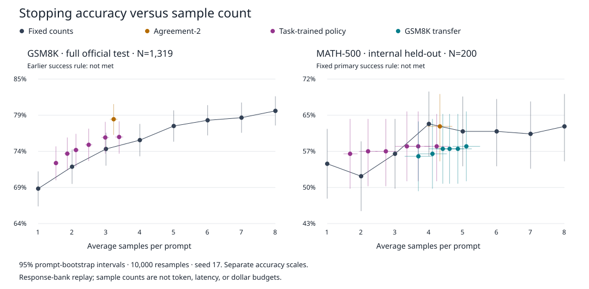

# BranchPilot

BranchPilot uses a learned value function to decide whether one more LLM answer is worth its sample cost.

**Question:** can I improve the accuracy–sampling trade-off beyond simple self-consistency stopping rules?

I built a sequential sampling loop, a small cost-conditioned MLP, and an evaluator that replays every rule on the same response bank. The core is [`runtime.py`](src/branchpilot/runtime.py), [`training.py`](src/branchpilot/training.py), and [`evaluate.py`](src/branchpilot/evaluate.py).

**The negative result extends to a second benchmark.** My learned rule failed its fixed success criterion on the full GSM8K test and on an internal MATH-500 holdout. On MATH, retraining improved the observed utility over transferring the old controller, but neither established an advantage over simple rules. This is one small model and one generation seed, not a general impossibility result.



## Results

Both studies use Qwen2.5-1.5B-Instruct and eight samples per problem. GSM8K has **1,319 official test problems**. For MATH-500, I fixed a new **200 train / 100 validation / 200 test** partition; this is **not** a full official MATH-500 test score.

| Benchmark | Rule | Accuracy | Mean samples |
|---|---|---:|---:|
| GSM8K | Fixed one | 68.8% | 1.00 |
| GSM8K | Learned, λ = 0.05 | 75.1% | 2.49 |
| GSM8K | Two consecutive matching answers | 78.8% | 3.23 |
| GSM8K | Fixed eight | 80.1% | 8.00 |
| MATH holdout | Fixed one | 55.0% | 1.00 |
| MATH holdout | MATH-trained, λ = 0.05 | 58.5% | 3.35 |
| MATH holdout | GSM8K transfer, λ = 0.05 | 58.0% | 4.61 |
| MATH holdout | Two consecutive matching answers | 62.5% | 4.33 |
| MATH holdout | Fixed eight | 62.5% | 8.00 |

Sources: [GSM8K prompt-bootstrap summary](benchmarks/gsm8k-sampling-bootstrap.json) and [MATH results](benchmarks/math500/result.json), with [per-prompt outcomes](benchmarks/math500/outcomes.json.gz).

The objective is **accuracy − λ × (samples − 1)**; λ is not a dollar price. I retained the original success rule: the paired utility interval must have a positive lower bound at two primary costs and a nonnegative bound at the third. The [MATH protocol](benchmarks/math500-protocol.json) was committed at [d475eeb](https://github.com/mottopanikeiku/branchpilot/commit/d475eeb) before sampling. I committed the [validation-selected comparators](benchmarks/math500/selection.json) at [29eea90](https://github.com/mottopanikeiku/branchpilot/commit/29eea90) before evaluating test decisions.

Validation selected fixed-one at all three primary costs. The new policy lost utility on the holdout:

| λ | Learned − comparator utility | Paired 95% interval |
|---|---:|---:|
| 0.05 | −0.0825 | [−0.1278, −0.0373] |
| 0.075 | −0.1048 | [−0.1440, −0.0659] |
| 0.10 | −0.0955 | [−0.1375, −0.0550] |

I also compared exactly matched **expected** sample budgets. At 3.35 samples, the fixed-three/four mixture scored 59.1% and the fixed-one/agreement mixture 60.3%, versus learned 58.5%. Both paired accuracy intervals crossed zero. These are descriptive comparisons: mixture weights use test counts, not accuracy, and their uncertainty is not included in the intervals.

## What I trained and measured

Training regresses backward STOP/CONTINUE targets along complete logged trajectories. Those targets use gold and the logged future; they are not an optimal conditional-expectation stopping solution. Inference sees only observed-prefix features. On MATH, symmetric [Math-Verify](https://github.com/huggingface/Math-Verify) checks assign vote labels from earlier responses only; gold correctness stays separate.

I committed [all **4,000 new responses**](benchmarks/math500/generation-manifest.json), full text, both controller artifacts, [generation code](tools/collect_math500.py), and [analysis code](tools/evaluate_math500.py). The [three compressed banks](benchmarks/math500/parser-summary.json) total **1,145,882 bytes**. Generation used vLLM 0.10.2 on one L4: **19.81 active cloud minutes**, plus a separate pilot. [Cost estimates](benchmarks/math500/cost.json) are **$0.35 active cloud use / $0.5117 conservative budget accounting**, including startup and a canceled-start reservation—not an invoice. I retained the [source dataset license notices](benchmarks/math500/LICENSE.txt); the mirror declares no separate license.

## Reproduce from committed data

```bash
uv sync --frozen
uv run python tools/plot_sampling_tradeoff.py
uv run python tools/evaluate_math500.py plot
uv run python tools/evaluate_math500.py test --selection-commit 29eea90
```

These commands recompute the GSM8K summary and replay the MATH study on CPU without model downloads or paid compute; on an unchanged checkout, `git diff` stays empty, and CI checks this. The `test` command reads the protocol and selection from their recorded commits, so it needs full git history rather than a shallow clone. Retraining requires the `train` extra: run `select`, commit its artifacts, then run `test` with that commit. Redrawing responses requires Modal and one L4; the generation script refuses to overwrite an existing bank.

## Limitations

- One model family, one seed, a small internal holdout, and possible benchmark contamination in pretraining.
- Symbolic grading can fail or time out; [460 truncated and seven unparsed outputs](benchmarks/math500/parser-summary.json) had no answer label. I kept the original unknown/tie handling.
- Response-bank replay is not a live sequential-serving or latency experiment.
- Sample budgets are not token, energy, or dollar budgets.
- Intervals are pointwise, conditional on this bank and fitted policy, not uncertainty across training/generation seeds.

## Prior work

I build on [self-consistency](https://arxiv.org/abs/2203.11171), [Adaptive-Consistency](https://arxiv.org/abs/2305.11860), and [Early-Stopping Self-Consistency](https://arxiv.org/abs/2401.10480), using [GSM8K](https://github.com/openai/grade-school-math), [MATH-500](https://huggingface.co/datasets/HuggingFaceH4/MATH-500), and [Qwen2.5](https://huggingface.co/Qwen/Qwen2.5-1.5B-Instruct). Code is [MIT licensed](LICENSE). [Earlier usage and the code map](docs/core-and-extras.md) remain available.

Written with AI coding assistance.
