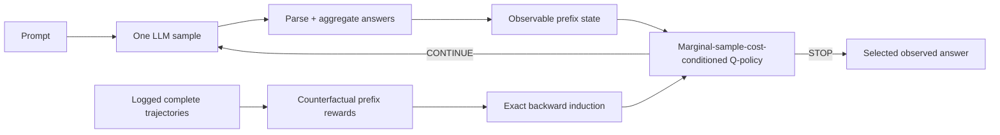

# BranchPilot

**Adaptive inference control, prompt by prompt.**

BranchPilot is a deployable control plane for sequential LLM sampling. After every completed sample it **observes** the parsed answer and usage, **decides** with a fixed, transparent, or learned strategy, then issues exactly one more request—or **stops**. The same bounded runtime works with local callbacks, OpenAI-compatible servers, a text-only gateway, and `its_hub`.

[Zero-GPU quick success](#zero-gpu-quick-success) · [Deployable strategies](#deployable-strategies) · [Gateway](#openai-compatible-gateway) · [Canonical v0.2 evidence · FAIL](https://mottopanikeiku.github.io/branchpilot/evidence/v0.2/)


The trace is deliberately literal: request 1 is observed, request 2 is observed, confidence reaches 1.00, and the confidence-0.85 strategy stops. Requests 3–8 are labeled **NOT ISSUED**. BranchPilot controls marginal sample requests; it does not turn sample count into a claim about latency, GPU time, energy, or dollars.

## Zero-GPU quick success

This source quickstart uses synthetic correlated trajectories and CPU training. It downloads no model and needs no GPU. The final command replays the exported heuristic plan through the same `PilotSession` used by learned policies:

```bash
git clone https://github.com/mottopanikeiku/branchpilot
cd branchpilot
uv sync --extra train
uv run branchpilot quickstart

uv run branchpilot plan \
  --benchmark artifacts/quickstart/validation-benchmark.json \
  --sample-budget 3.5 \
  --family heuristic \
  --json-output artifacts/quickstart/plan.json

uv run branchpilot demo \
  --data artifacts/quickstart/test.jsonl \
  --plan artifacts/quickstart/plan.json \
  --index 7
```

`quickstart` writes disjoint synthetic train, validation, and test trajectories, a Safetensors policy, exhaustive fixed/heuristic/learned validation rows, and a standalone validation report under `artifacts/quickstart/`. The plan is selected only from `validation-benchmark.json`; `demo --plan` then replays it on `test.jsonl`, printing every observed-prefix decision, the stopping point, and how many allowed requests were never issued.

## The control loop

```text
prompt
  └─ request one n=1 sample
       └─ observe parsed answer + completion usage
            └─ strategy decides from the observed prefix
                 ├─ CONTINUE → request exactly one more sample
                 └─ STOP     → return the selected observed response
```

A strategy never receives a gold answer or a future sample at deployment. The horizon is hard-bounded. `PilotSession.run` and `run_async` call the sampler once per CONTINUE decision and never after STOP.

## Deployable strategies

All four implementations satisfy the same `StoppingStrategy` interface and can be loaded from strict JSON deployment plans.

| Strategy | Decision rule | Best fit |
|---|---|---|
| `FixedStrategy` | Stop after an operator-selected count | predictable default and baseline |
| `VoteConfidenceStrategy` | Stop when leading vote share reaches a threshold after a minimum count | inspectable answer-consensus control |
| `ConsecutiveAgreementStrategy` | Stop after a run of identical parsed answers | inspectable stability control |
| `BranchPilotPolicy` | Compare learned STOP/CONTINUE values at a declared marginal sample cost $\lambda$ | validation-supported learned control |

Built-in specs are small, executable-code-free JSON:

```json
{"type":"fixed","samples":2,"max_samples":8}
{"type":"vote_confidence","threshold":0.85,"minimum":2,"max_samples":8}
{"type":"consecutive_agreement","streak":2,"max_samples":8}
```

Learned deployments use a bounded, non-executable Safetensors artifact. Their plan records the policy-relative path, SHA-256 digest, and a $\lambda$ inside that policy's trained marginal-sample-cost interval. Loading fails closed on schema, shape, dtype, finiteness, size, file type, or digest mismatch.

### Choose from validation with `plan`

`branchpilot plan` reads deployable validation rows across **learned**, **fixed**, and **heuristic** families and rejects benchmark payloads not explicitly marked as the validation split. Every exported plan is schema-versioned and records a canonical SHA-256 digest of the complete selection payload. By default a row is feasible only when its upper 95% average-sample bound meets the requested budget. Among feasible rows it chooses the highest measured validation accuracy, then the lower measured sample count; if none is feasible it returns the minimum-sample row with `budget_satisfied: false`.

Inspect the cross-strategy choice without exporting it:

```bash
uv run branchpilot plan \
  --benchmark artifacts/quickstart/validation-benchmark.json \
  --sample-budget 3.5
```

Export a built-in strategy by limiting the rerun to its family and omitting `--policy`:

```bash
uv run branchpilot plan \
  --benchmark artifacts/quickstart/validation-benchmark.json \
  --sample-budget 3.5 \
  --family heuristic \
  --json-output artifacts/quickstart/plan.json
```

A learned export **requires** the matching policy so the plan can bind its content digest and relative path:

```bash
uv run branchpilot plan \
  --benchmark artifacts/quickstart/validation-benchmark.json \
  --sample-budget 3.5 \
  --family learned \
  --policy artifacts/quickstart/policy.safetensors \
  --json-output artifacts/quickstart/learned-plan.json
```

`--policy` is valid only when the selected family is learned. `--point-estimate` opts out of upper-bound feasibility; `--family` may be repeated when comparing a subset.

## OpenAI-compatible gateway

`branchpilot-gateway` is a text-only, non-streaming OpenAI-compatible control surface. The operator config binds public model aliases to upstreams, immutable decoding options, hard request/session limits, answer extraction, and a deployment plan. [`examples/gateway.json`](examples/gateway.json) routes `math-local` to a vLLM server at `127.0.0.1:8001` using [`examples/gateway-plan.json`](examples/gateway-plan.json).

From a source checkout, set the two secret environment variables named by the config:

```bash
export BRANCHPILOT_GATEWAY_KEY=client-secret
export BRANCHPILOT_UPSTREAM_KEY=upstream-secret
```

Run vLLM in its own environment and process. vLLM is an upstream boundary, not part of the BranchPilot gateway extra:

```bash
vllm serve Qwen/Qwen2.5-1.5B-Instruct \
  --host 127.0.0.1 \
  --port 8001 \
  --api-key "$BRANCHPILOT_UPSTREAM_KEY"
```

In a second process, install and start the gateway from this source tree:

```bash
uv sync --extra gateway
uv run branchpilot-gateway \
  --config examples/gateway.json \
  --host 127.0.0.1 \
  --port 8000
```

A standard OpenAI client works unchanged. Use the raw-response wrapper only when the BranchPilot result headers are needed:

```python
import os
from openai import OpenAI

client = OpenAI(
    base_url="http://127.0.0.1:8000/v1",
    api_key=os.environ["BRANCHPILOT_GATEWAY_KEY"],
)
raw = client.chat.completions.with_raw_response.create(
    model="math-local",
    messages=[{"role": "user", "content": "What is 17 + 25?"}],
)
completion = raw.parse()
print(completion.choices[0].message.content)
print(raw.headers["x-branchpilot-samples"])
print(raw.headers["x-branchpilot-strategy"])
print(raw.headers["x-branchpilot-selection"])
```

The same response and headers are visible with curl:

```bash
curl -i http://127.0.0.1:8000/v1/chat/completions \
  -H "Authorization: Bearer $BRANCHPILOT_GATEWAY_KEY" \
  -H "Content-Type: application/json" \
  -d '{"model":"math-local","messages":[{"role":"user","content":"What is 17 + 25?"}]}'
```

Successful responses include `x-request-id`, `x-branchpilot-samples`, `x-branchpilot-strategy`, and `x-branchpilot-selection`. The body is a standard chat completion whose usage aggregates the sequential upstream requests. The gateway makes one upstream `n=1` request per CONTINUE step; it does not retry or estimate missing usage.

## Installation from source

BranchPilot requires **Python 3.10 or newer**. This repository is source-first; the commands below make no package-index availability claim.

| Channel | Source command | Adds |
|---|---|---|
| Core runtime | `uv sync` | NumPy runtime, strategies, plans, Safetensors loading |
| Training | `uv sync --extra train` | optional PyTorch fitting |
| Gateway | `uv sync --extra gateway` | FastAPI, OpenAI client, HTTP transport, Uvicorn |
| `its_hub` | `uv sync --extra its-hub` | `its_hub` adapter; **Python 3.11+** required by the integration dependency |
| Direct OpenAI adapter | `uv sync --extra openai` | OpenAI SDK without the gateway server |

Extras compose, for example `uv sync --extra train --extra gateway`. Importing `branchpilot` core does not import provider SDKs, gateway dependencies, PyTorch, or `its_hub`.

## Live control APIs

### Core callback loop

The core package is model-server agnostic. Feed one canonical observation at a time:

```python
from branchpilot import PilotSession, Sample, VoteConfidenceStrategy

strategy = VoteConfidenceStrategy(threshold=0.85, minimum=2, max_samples=8)
session = PilotSession(strategy, "What is 17 + 25?", cost=0.0, max_samples=8)

while session.should_continue:
    output = generate_one_sample()  # your local server or provider call
    session.observe(
        Sample(
            text=output.text,
            answer=parse_answer(output.text),
            token_count=output.token_count,
            mean_logprob=output.mean_logprob,
        )
    )

result = session.result()
print(result.answer, result.sample_count, result.completion_tokens)
```

For a learned policy, replace the strategy construction with `BranchPilotPolicy.load("policy.safetensors")` and pass a $\lambda$ inside its trained marginal-sample-cost interval.

### Sequential OpenAI adapter

The async adapter keeps the control loop in-process without coupling core to the provider SDK:

```python
from openai import AsyncOpenAI
from branchpilot.answers import extract_answer
from branchpilot.integrations import run_openai

result = await run_openai(
    strategy,
    AsyncOpenAI(base_url="http://localhost:8001/v1", api_key="local"),
    model="Qwen/Qwen2.5-1.5B-Instruct",
    messages=[{"role": "user", "content": question}],
    extractor=extract_answer,
    question=question,
    cost=0.0,
    max_samples=8,
    request_options={"temperature": 0.7, "logprobs": True},
)
```

The adapter requires real completion-token usage, preserves missing log-probabilities as missing, rejects truncated answers, and performs no retries. It never infers the marginal sample cost $\lambda$ from provider pricing.

### `its_hub` adapter

`branchpilot.integrations.its_hub.BranchPilotAlgorithm` exposes any observed-prefix BranchPilot strategy as an `its_hub` scaling algorithm. It preserves the sequential horizon, returns all observed responses plus the selected response, and never launches work after STOP.

## Evidence: canonical v0.2 learned-policy criterion — FAIL

**[Canonical v0.2 evidence · FAIL](https://mottopanikeiku.github.io/branchpilot/evidence/v0.2/)**

The locked evaluation used **Qwen2.5-1.5B-Instruct**, 1,600 controller-training prompts, 400 validation prompts, and the complete **1,319-example official GSM8K test**, with 8 samples per prompt. Comparator names were selected on validation and committed before test. Every point uses 10,000 paired prompt-bootstrap resamples.

**The prespecified learned-policy success rule did not pass.** Utility-delta 95% lower bounds at the three primary marginal sample costs were $-0.0152$, $-0.0422$, and $-0.0491$; the protocol required at least two to be strictly positive and the third nonnegative. The learned policy advanced the fixed-count sample frontier at some operating points, but the validation-frozen comparators were stronger under this single-model, single-task utility comparison.

| Policy | Accuracy | Avg. samples | What the official test shows |
|---|---:|---:|---|
| fixed-1 | 68.8% | 1.00 | minimum-sample reference |
| BranchPilot $\lambda=0.15$ | 72.5% | 1.52 | learned fixed-frontier point |
| fixed-2 | 71.9% | 2.00 | fixed reference |
| BranchPilot $\lambda=0.05$ | 75.1% | 2.49 | measured above fixed-3 accuracy with fewer average samples |
| fixed-3 | 74.5% | 3.00 | fixed reference |
| BranchPilot $\lambda=0.025$ | 76.2% | 2.98 | +1.7 accuracy points versus fixed-3 at similar sample count |
| agreement-2 | 78.8% | 3.23 | stronger frozen adaptive comparator at low marginal sample cost |
| fixed-8 | 80.1% | 8.00 | maximum-sample ceiling |

This FAIL is evidence about the canonical learned strategy, not a claim that the fixed, confidence, or consecutive-agreement control plane is broken. It remains prominent so adopters can choose strategies from validation instead of treating learned control as the default.

**Frozen HTML and checksums:** [standalone report](benchmarks/report-v2.html) · [detached checksums](benchmarks/checksums-v2.txt)

**Machine evidence:** [test JSON](benchmarks/gsm8k-v2.json) · [validation freeze](benchmarks/gsm8k-v2-validation.json) · [generation manifest](benchmarks/manifest-v2.json) · [protocol](benchmarks/protocol.json)

The exploratory v0.1 point-estimate study is retained only for provenance: [frozen report](benchmarks/report.html), [aggregate JSON](benchmarks/gsm8k.json), and [manifest](benchmarks/manifest.json).

### Train-only v3 capacity gate — NO-GO

After the v0.2 learned-policy criterion failed, a new protocol was [frozen and committed](benchmarks/protocol-v3-development.json) before receiving rerun results. It compared four smaller controllers across five UID-grouped folds of the 1,600 controller-training prompts. Promotion required positive pooled utility deltas versus `agreement-2` at all three primary costs, nonnegative lower 95% bounds at two, and no fold below $-0.01$.

| Candidate | $\lambda=0.01$ utility $\Delta$ [95% CI] | $\lambda=0.025$ | $\lambda=0.05$ |
|---|---:|---:|---:|
| hidden 8 · 20 epochs | $-0.0166$ [$-0.0286$, $-0.0048$] | $-0.0027$ [$-0.0143$, $0.0089$] | $+0.0221$ [$+0.0097$, $+0.0346$] |
| hidden 8 · 40 epochs | $-0.0059$ [$-0.0137$, $+0.0018$] | $-0.0061$ [$-0.0146$, $+0.0022$] | $+0.0109$ [$+0.0012$, $+0.0203$] |
| hidden 16 · 20 epochs | $-0.0081$ [$-0.0173$, $+0.0010$] | $-0.0036$ [$-0.0124$, $+0.0053$] | $+0.0068$ [$-0.0027$, $+0.0163$] |
| hidden 16 · 40 epochs | $-0.0038$ [$-0.0101$, $+0.0027$] | $-0.0127$ [$-0.0192$, $-0.0062$] | $-0.0045$ [$-0.0123$, $+0.0033$] |

No candidate passed. Fresh-holdout generation was not authorized, and the result records zero fresh-holdout model requests at the decision. Complete fold metrics, training times, gate calculations, rejected-run disclosure, and all 19,200 paired prompt outcomes are preserved in the [result](benchmarks/gsm8k-v3-capacity.json), [compressed outcomes](benchmarks/gsm8k-v3-capacity-outcomes.json.gz), and [checksums](benchmarks/checksums-v3-development.txt).

## How the learned policy works

Most fixed-sampling systems choose one count for every prompt. The learned BranchPilot strategy instead models a finite-horizon STOP/CONTINUE decision from each observed prefix.



For prefix state $s_t$ and action $a_t$:

$$
r(s_t, \mathrm{STOP})=\mathbb{1}[\hat y_t=y], \qquad
r(s_t, \mathrm{CONTINUE})=-\lambda
$$

$$
Q(s_t,\mathrm{CONTINUE};\lambda)=-\lambda+\max_a Q(s_{t+1},a;\lambda)
$$

Here $\lambda$ is the objective's **marginal cost of one additional sample**. It is not a dollar, latency, GPU-time, energy, or token conversion.

Complete offline trajectories expose the STOP reward and next prefix at every step. BranchPilot solves each logged trajectory by backward induction, then distills those targets into one policy over a declared $\lambda$ interval. Observable features cover vote share and margin, normalized answer entropy, diversity, parse and log-probability coverage, finite sequence-confidence statistics, latest-sample agreement, completion-length statistics, prompt structure, and remaining horizon. Isotonic advantage projection prevents a higher marginal sample cost from making a shared prefix more likely to continue.

Training uses Huber loss, deterministic seeds, gradient clipping, and explicit terminal-action masking. PyTorch is isolated to the optional training environment. Deployment and evaluation use NumPy plus Safetensors.

## Scope, limitations, and positioning

- Offline learning needs labeled complete trajectories; deployment receives neither gold labels nor future samples. Fixed and heuristic strategies do not require policy training.
- Every selected strategy must be validated for its model, decoding configuration, task distribution, answer extractor, sample horizon, and serving environment. Distribution shift must be measured before deployment.
- The learned objective prices an additional **sample** with $\lambda$. Samples and completion tokens are reported separately; neither is silently relabeled as latency, GPU-seconds, energy, or dollars.
- Batched pre-generated response banks support offline counterfactual evaluation. Live sequential `n=1` request behavior, latency, and infrastructure effects must be measured in the target serving system.
- A STOP decision can prevent later marginal requests from being issued; it cannot reclaim work an upstream server already launched or batched speculatively.
- This project controls self-consistency sampling. It does not modify model weights, own model routing/tree search/layer exit, or claim a new language-model benchmark score.
- The canonical v0.2 result covers one model, one task, and one learned-policy protocol. It is not evidence of general learned-policy superiority; its prespecified criterion failed.

BranchPilot does **not** claim the first learned, RL, MDP, or marginal-sample-cost-aware adaptive sampler. Direct prior systems include [Adaptive-Consistency](https://arxiv.org/abs/2305.11860), [Early-Stopping Self-Consistency](https://arxiv.org/abs/2401.10480), and [RL-Guided Adaptive Sampling](https://arxiv.org/abs/2606.03102). BranchPilot's narrower contribution is an adoptable control plane: interchangeable transparent and learned strategies, exact observed-prefix request discipline, strict deployment plans, bounded non-executable learned artifacts, OpenAI-compatible serving, and evidence/provenance tooling designed to fail closed.

## Reproduce the frozen Modal benchmark

[`benchmarks/protocol.json`](benchmarks/protocol.json) fixes source/model revisions and hashes, the immutable vLLM image digest, split sizes, sample bank, controller, baseline grid, bootstrap, success rule, and limitations before canonical generation. The reproduction below is intentionally later than the deployable product path; it regenerates research evidence rather than starting the gateway.

```bash
uv sync --extra dev --extra modal
modal setup

# Generate disjoint controller-train/validation banks and the complete official test.
uv run modal run modal_app.py \
  --train-size 1600 --validation-size 400 --test-size 1319 \
  --max-samples 8 --max-tokens 512 --seed 17 \
  --protocol benchmarks/protocol.json \
  --output-dir artifacts/gsm8k-v2

# Preserve the generation manifest as canonical small evidence.
cp artifacts/gsm8k-v2/manifest.json benchmarks/manifest-v2.json

# Fail closed on duplicate or overlapping model-visible prompts.
uv run branchpilot audit \
  --data artifacts/gsm8k-v2/train.jsonl \
  --compare artifacts/gsm8k-v2/validation.jsonl
uv run branchpilot audit \
  --data artifacts/gsm8k-v2/train.jsonl \
  --compare artifacts/gsm8k-v2/test.jsonl

uv run branchpilot train \
  --data artifacts/gsm8k-v2/train.jsonl \
  --output artifacts/gsm8k-v2/policy.safetensors \
  --hidden-size 128 --epochs 120 --seed 23 \
  --protocol benchmarks/protocol.json \
  --manifest benchmarks/manifest-v2.json

# Select comparators on validation and bind them to the frozen inputs.
uv run branchpilot evaluate \
  --data artifacts/gsm8k-v2/validation.jsonl \
  --policy artifacts/gsm8k-v2/policy.safetensors \
  --output benchmarks/gsm8k-v2-validation.json \
  --export-baselines benchmarks/gsm8k-v2-baselines.json \
  --protocol benchmarks/protocol.json \
  --manifest benchmarks/manifest-v2.json \
  --split validation

# Commit protocol + manifest + validation benchmark + selection before test evaluation.

uv run branchpilot evaluate \
  --data artifacts/gsm8k-v2/test.jsonl \
  --policy artifacts/gsm8k-v2/policy.safetensors \
  --frozen-baselines benchmarks/gsm8k-v2-baselines.json \
  --protocol benchmarks/protocol.json \
  --manifest benchmarks/manifest-v2.json \
  --split test \
  --output benchmarks/gsm8k-v2.json \
  --svg assets/gsm8k-v2-pareto.svg \
  --html benchmarks/report-v2.html
```

The report publishes every fixed count 1–8, the complete confidence/agreement grids, learned rows, retained prompt-paired outcomes, bootstrap intervals, stop histograms, validation-selection chain, primary and sensitivity marginal sample costs, exact pass/fail rule, source/data/policy/protocol hashes, and declared limitations. Results remain unchanged whether the rule passes or fails.

## CLI reference

| Command | Purpose |
|---|---|
| `branchpilot quickstart` | Run the zero-GPU synthetic → train → benchmark → report pipeline |
| `branchpilot synthetic` | Generate deterministic correlated reasoning trajectories |
| `branchpilot split` | Create seeded, fingerprinted, verified-disjoint data splits |
| `branchpilot audit` | Validate identity disjointness and profile parse/logprob/token coverage |
| `branchpilot train` | Fit exact backward Q-targets and save a safe policy artifact |
| `branchpilot evaluate` | Bootstrap exhaustive learned/fixed/heuristic rows; freeze or consume validation comparators |
| `branchpilot report` | Render standalone HTML/SVG evidence from benchmark JSON |
| `branchpilot plan` | Choose a deployable learned/fixed/heuristic validation row for an average sample budget |
| `branchpilot demo` | Replay a policy or plan as a decision flight recorder |
| `branchpilot-gateway` | Serve a configured plan through a text-only OpenAI-compatible API |

Run `uv run branchpilot <command> --help` or `uv run branchpilot-gateway --help` for exact controls.

## Data contract

A JSONL trajectory contains a prompt, canonical gold answer, and one or more complete sample observations:

```json
{"schema_version":2,"uid":"gsm8k-train-0","question":"...","gold":"72","samples":[{"text":"... #### 72","answer":"72","token_count":94,"mean_logprob":-0.31,"finish_reason":"stop","parse_status":"parsed"}],"prompt_tokens":81,"metadata":{"model":"Qwen/Qwen2.5-1.5B-Instruct"}}
```

`extract_answer` is strict by default. It accepts complete `####`, XML, or LaTeX-boxed final answers and canonicalizes comma, decimal, signed, percentage, and fractional numeric forms. The frozen Modal collector separately records `parsed_explicit` and `parsed_fallback`: last-number fallback is allowed only after the engine reports a completed response, never after token-limit truncation. Unparsed samples remain distinct and cannot manufacture false consensus.

## Repository map

```text
src/branchpilot/
  strategies.py    fixed, vote-confidence, consecutive-agreement interface
  deployment.py    strict plans; built-in specs; hash-bound learned loading
  calibration.py   cross-family validation selection for sample budgets
  runtime.py       label-free sync/async sequential inference sessions
  policy.py        Torch-free NumPy policy and safe Safetensors artifacts
  training.py      exact backward Q-targets and optional PyTorch fitting
  features.py      offline/live observed-prefix aggregation and state
  answers.py       strict answer extraction and numeric canonicalization
  evaluate.py      exhaustive learned/fixed/heuristic rows and paired bootstrap
  gateway/
    config.py      environment-bound routes, limits, plans, and options
    upstream.py    request-exact sequential OpenAI upstream client
    app.py         text-only OpenAI-compatible control-plane API
    cli.py         branchpilot-gateway process entry point
  integrations/
    openai.py      in-process sequential OpenAI adapter
    its_hub.py     BranchPilotAlgorithm for its_hub scaling workflows
  integrity.py     fingerprints, overlap checks, and dataset profiles
  provenance.py    frozen protocol and byte-exact manifest verification
  report.py        dependency-free HTML and accessible SVG evidence
  artifacts.py     atomic writes, hashes, and output alias checks
  synthetic.py     zero-GPU correlated reasoning environment
  cli.py           end-to-end command interface
examples/           gateway config and deployable heuristic plan
modal_app.py        pinned vLLM rollout collection on Modal L4
benchmarks/         frozen protocol, complete metrics, checksums, offline reports
assets/             product landing, flight recorder, and evidence figures
tests/              behavioral contracts and edge-case coverage
```

## License

MIT
