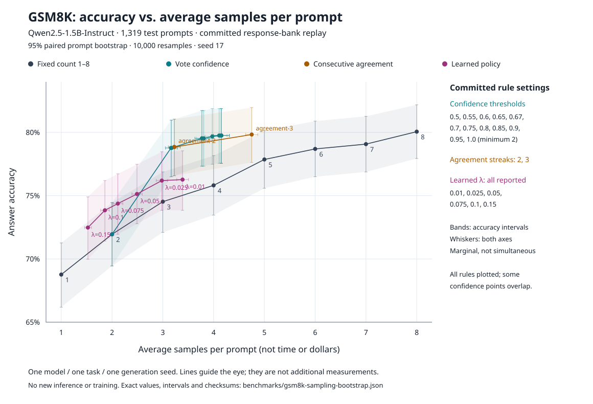

# BranchPilot

BranchPilot decides whether to request another LLM answer or stop and return an answer already observed.

**Question:** can a learned stopping rule use fewer samples than fixed-count self-consistency without losing accuracy?

The loop requests one sample, updates answer-vote features, and asks a strategy to STOP or CONTINUE. [`runtime.py`](src/branchpilot/runtime.py) runs it; [`training.py`](src/branchpilot/training.py) fits a small cost-conditioned MLP; [`evaluate.py`](src/branchpilot/evaluate.py) compares fixed, agreement, confidence, and learned rules on the same prompts.

**Result: the learned rule did not meet the GSM8K success criterion.** It improved some fixed-count trade-offs, but simple agreement was stronger at low sample cost. This is one model on one task, not evidence of general learned-policy superiority.



## What the experiment shows

The [generation manifest](benchmarks/manifest-v2.json) records Qwen2.5-1.5B-Instruct on an NVIDIA L4 with vLLM 0.10.2: 1,600 training prompts, 400 validation prompts, and the full 1,319-prompt GSM8K test; eight samples per prompt, 26,552 samples total. Comparator choices came from validation, before test evaluation.

| Rule | Test accuracy | Average samples |
|---|---:|---:|
| Fixed one | 68.8% | 1.00 |
| Learned, λ = 0.15 | 72.5% | 1.52 |
| Fixed three | 74.5% | 3.00 |
| Learned, λ = 0.025 | 76.2% | 2.98 |
| Two consecutive matching answers | 78.8% | 3.23 |
| Fixed eight | 80.1% | 8.00 |

Source: [committed test outcomes](benchmarks/gsm8k-v2.json). The objective is accuracy minus λ times additional samples; λ is not a price in dollars. The [protocol](benchmarks/protocol.json) required positive paired utility lower bounds at two primary costs and a nonnegative bound at the third. The learned policy failed that rule. A later [training-only capacity comparison](benchmarks/gsm8k-v3-capacity.json) also found no candidate that passed its stated criterion.

The figure is a new analysis of the committed per-prompt outcomes, not a new model run. It includes every fixed count, both agreement rules, the confidence grid, and the learned cost settings. Shading and error bars show pointwise prompt-bootstrap uncertainty, not a confidence band for selecting the best rule after looking at test data. The [script](tools/plot_sampling_tradeoff.py) and [numeric summary](benchmarks/gsm8k-sampling-bootstrap.json) retain the method and input hash.

## What “exact” means here

Training computes finite-horizon STOP/CONTINUE targets by backward induction along each complete logged trajectory, then regresses those targets on observable-prefix features. **Exact is pathwise:** offline targets can use the particular logged future and gold answer. They do not solve the conditional expectation over future samples or guarantee optimal non-clairvoyant stopping. At inference, the strategy receives only the observed prefix, never the gold answer or future samples.

Runtime, strategies, learner, and evaluation are the core. Gateway/provider adapters, pricing, traffic audit, importers, cache analysis, and persistence are secondary tools, not evidence for the GSM8K finding. [The code map and earlier detailed usage](docs/core-and-extras.md) separate these paths and link the preserved study instructions.

## Reproduce the figure

From a source checkout, with Python satisfying [the package requirement](pyproject.toml) and `uv`:

```bash
uv sync --frozen
nice -n 19 uv run --frozen python tools/plot_sampling_tradeoff.py
```

This analysis uses committed data, local CPU, no model download, no GPU, and no paid service. It does not regenerate the original L4 sample bank or retrain the policy. The full rollout text and trained policy are not committed; the historical collection instructions are retained in the linked detailed notes. The original generation's monetary cost is not recorded here.

## Limitations

- One small model, one numeric reasoning task, and one generation seed.
- Logged, batched response-bank evaluation is not a sequential-serving latency experiment.
- Sample count is not token use, GPU time, energy, or money.
- Answer parsing and vote tie-breaking affect both training and evaluation.
- Pointwise bootstrap intervals do not correct for trying multiple rules on the same test set.

## Prior work

This builds on [self-consistency](https://arxiv.org/abs/2203.11171), [Adaptive-Consistency](https://arxiv.org/abs/2305.11860), and [Early-Stopping Self-Consistency](https://arxiv.org/abs/2401.10480). It does not claim to invent adaptive sampling. The experiment uses the [GSM8K dataset](https://github.com/openai/grade-school-math) and [Qwen2.5 model](https://huggingface.co/Qwen/Qwen2.5-1.5B-Instruct), rather than a new language model. Code is under the [MIT license](LICENSE).
