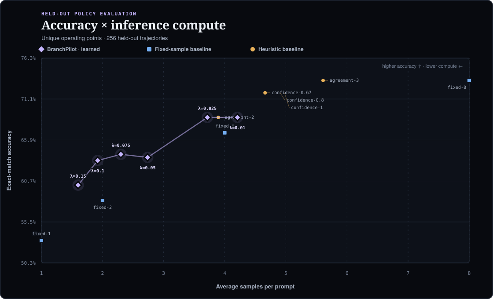
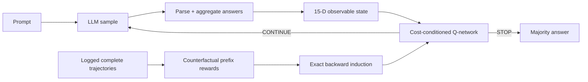

<div align="center">

# BranchPilot

**A lightweight cost-conditioned controller that stops LLM self-consistency at the prompt-specific point of diminishing returns.**

[](https://github.com/mottopanikeiku/branchpilot/actions/workflows/ci.yml)
[](https://mottopanikeiku.github.io/branchpilot/)
[](https://www.python.org/)
[](https://modal.com/)
[](LICENSE)



</div>

Most inference-time scaling systems pick one global sample count: easy prompts are overthought; hard prompts are abandoned too early. BranchPilot turns that systems decision into an observable finite-horizon stopping problem. A single universal Q-network watches agreement, parse coverage, answer entropy, sequence confidence, completion length, prompt structure, remaining horizon, and a user-selected cost $\lambda$. It chooses **STOP** or **CONTINUE** after every observed sample.

Complete offline trajectories expose the STOP reward and next prefix at every step. BranchPilot solves each logged trajectory exactly by backward induction, then distills those counterfactual Q-values into one cost-conditioned policy. Deployment uses a Torch-free NumPy runtime and bounded, non-executable Safetensors artifacts.

## Exploratory v0.1 result

The currently committed benchmark is an exploratory point-estimate study from the original v0.1 pipeline: **Qwen2.5-1.5B-Instruct**, 8 stochastic samples per prompt, 512 controller-training trajectories, and 256 controller-held-out trajectories drawn from GSM8K train. It uses one generation seed, one controller seed, a sparse baseline grid, and no confidence intervals. It is retained for provenance while the preregistered official-test benchmark is regenerated with the v0.2 evaluation protocol.

| Policy | Accuracy | Avg. samples | Comparison |
|---|---:|---:|---|
| fixed-2 | 58.2% | 2.00 | static baseline |
| **BranchPilot $\lambda=0.10$** | **63.3%** | **1.92** | **+5.1 points with less compute** |
| fixed-4 | 66.8% | 4.00 | static baseline |
| **BranchPilot $\lambda=0.025$** | **68.8%** | **3.71** | **+2.0 points with 7.1% fewer samples** |
| fixed-8 | 73.4% | 8.00 | maximum-compute ceiling |

The observed v0.1 utility $U=\text{accuracy}-\lambda\times\text{samples}$ favored the learned controller over the listed fixed-count and agreement/confidence baselines at $\lambda\in\{0.05,0.075,0.10\}$. This is not yet a confirmatory or generality claim. Full aggregate rows live in [`benchmarks/gsm8k.json`](benchmarks/gsm8k.json), with recorded provenance in [`benchmarks/manifest.json`](benchmarks/manifest.json) and the standalone report in [`benchmarks/report.html`](benchmarks/report.html).

## How it works



For prefix state $s_t$ and action $a_t$:

$$
r(s_t, \mathrm{STOP})=\mathbb{1}[\hat y_t=y], \qquad
r(s_t, \mathrm{CONTINUE})=-\lambda
$$

$$
Q(s_t,\mathrm{CONTINUE};\lambda)=-\lambda+\max_a Q(s_{t+1},a;\lambda)
$$

The 15 observable features include vote share and margin, normalized answer entropy, diversity, parse and log-probability coverage, finite sequence-confidence statistics, latest-sample agreement, completion-length statistics, prompt token/character length, numeric density, and horizon progress. Three conditioning features add $\lambda$, normalized remaining horizon, and their interaction. One network covers the declared training-cost interval; inference applies isotonic advantage projection so higher cost cannot make a shared prefix more likely to continue.

Training regresses exact finite-horizon Q-targets with Huber loss, deterministic seeds, gradient clipping, and explicit terminal-action masking. PyTorch is isolated to the optional training environment. Deployment and evaluation need only NumPy plus Safetensors; policy artifacts are non-pickle, strictly schema/shape/dtype/finiteness checked, size-bounded, and written atomically.

## Five-minute local demo

No model download or GPU required. The quickstart builds correlated reasoning trajectories, trains the controller with the `train` extra, evaluates fixed/heuristic baselines, renders the Pareto report, and prints a Q-value trace.

```bash
git clone https://github.com/mottopanikeiku/branchpilot
cd branchpilot
uv sync --extra dev
uv run branchpilot quickstart
xdg-open artifacts/quickstart/report.html
```

Inspect a specific decision path:

```bash
uv run branchpilot demo \
  --data artifacts/quickstart/test.jsonl \
  --policy artifacts/quickstart/policy.safetensors \
  --cost 0.05 --index 7
```

## Live inference API

Offline labels train the policy; deployment never receives a gold answer or future sample. Feed one canonicalized observation at a time and stop launching model requests as soon as the policy stops:

```python
from branchpilot import BranchPilotPolicy, Sample

policy = BranchPilotPolicy.load("policy.safetensors")
session = policy.start("What is 17 + 25?", cost=0.05, max_samples=8)

while session.should_continue:
    output = generate_one_sample()  # your vLLM, SGLang, or API call
    session.observe(
        Sample(
            text=output.text,
            answer=parse_answer(output.text),
            token_count=output.token_count,
            mean_logprob=output.mean_logprob,
        )
    )

result = session.result()
print(result.answer, result.sample_count, result.completion_tokens)
```

`PilotSession.run` and `run_async` provide callback loops with the same invariant: the sampler is called exactly once per observed decision and never after STOP.

## Reproduce the Modal benchmark

The model, model revision, CUDA base, vLLM, Transformers, Tokenizers, sampling configuration, and seeds are pinned. The Hugging Face cache persists in a Modal Volume.

```bash
uv sync --extra dev --extra modal
modal setup

# Batched generation on one Modal L4.
uv run modal run modal_app.py \
  --train-size 768 --test-size 256 --max-samples 8 \
  --seed 17 --output-dir artifacts/gsm8k

# Make a deterministic, disjoint 512/256 controller split from generated train trajectories.
uv run branchpilot split \
  --data artifacts/gsm8k/train.jsonl \
  --train-output artifacts/gsm8k/controller-train.jsonl \
  --test-output artifacts/gsm8k/controller-test.jsonl \
  --train-size 512 --test-size 256 --seed 23

uv run branchpilot train \
  --data artifacts/gsm8k/controller-train.jsonl \
  --output artifacts/gsm8k/policy.safetensors \
  --hidden-size 128 --epochs 120 --seed 23

uv run branchpilot evaluate \
  --data artifacts/gsm8k/controller-test.jsonl \
  --policy artifacts/gsm8k/policy.safetensors \
  --output artifacts/gsm8k/benchmark.json \
  --svg artifacts/gsm8k/pareto.svg \
  --html artifacts/gsm8k/report.html
```

The recorded run generated 1,680,954 completion tokens in 607.3 generation-seconds at 2,767.9 output tokens/s on an L4. Image build, model download, and engine initialization are excluded from that generation timer. The workload stays comfortably inside a $30 Modal credit budget.

## CLI

| Command | Purpose |
|---|---|
| `branchpilot quickstart` | Run the complete zero-GPU simulator → train → benchmark → report pipeline |
| `branchpilot synthetic` | Generate deterministic correlated reasoning trajectories |
| `branchpilot split` | Create seeded, disjoint controller train/evaluation sets |
| `branchpilot train` | Fit and save the budget-conditioned Q-controller |
| `branchpilot evaluate` | Compare against fixed, vote-confidence, and agreement baselines |
| `branchpilot demo` | Print every Q-value and STOP/CONTINUE action for one trajectory |

Run `uv run branchpilot <command> --help` for all controls.

## Data contract

BranchPilot is model-server agnostic. A JSONL trajectory needs a prompt, canonical gold answer, and one or more samples:

```json
{"uid":"gsm8k-train-0","question":"...","gold":"72","samples":[{"text":"... #### 72","answer":"72","token_count":94,"mean_logprob":-0.31}],"prompt_tokens":81,"metadata":{"model":"Qwen/Qwen2.5-1.5B-Instruct"}}
```

Benchmark collection uses strict final-answer delimiters (`####`, XML, or LaTeX boxed forms) before canonicalizing comma, decimal, signed, and fractional numeric values. Unparsed samples remain distinct and can never manufacture false consensus; permissive last-number extraction is explicit opt-in only.

## Repository map

```text
src/branchpilot/
  answers.py      strict answer extraction and numeric canonicalization
  features.py     offline/live prefix aggregation and 15-D state
  policy.py       Torch-free NumPy inference and safe Safetensors artifacts
  runtime.py      label-free sync/async incremental inference sessions
  training.py     exact backward Q-targets and optional PyTorch fitting
  evaluate.py     fixed, confidence, agreement, and learned policies
  report.py       dependency-free SVG + standalone HTML research report
  artifacts.py    atomic writes, hashes, and output alias checks
  synthetic.py    zero-GPU correlated reasoning environment
  cli.py          end-to-end command interface
modal_app.py       pinned vLLM rollout collection on Modal L4
benchmarks/        complete held-out metrics, provenance, offline report
tests/             behavioral contracts and edge-case coverage
```

## Scope and limitations

- The controller needs labeled trajectories for offline training; deployment decisions need no labels.
- A policy is calibrated to a model, decoding configuration, task distribution, and answer aggregator. Distribution shift should be measured before deployment.
- Sample count is the optimized cost unit. Token-weighted or wall-clock rewards are natural extensions when serving traces expose reliable per-request costs.
- This project controls self-consistency sampling; it does not modify model weights or claim a new language-model benchmark score.

## License

MIT
